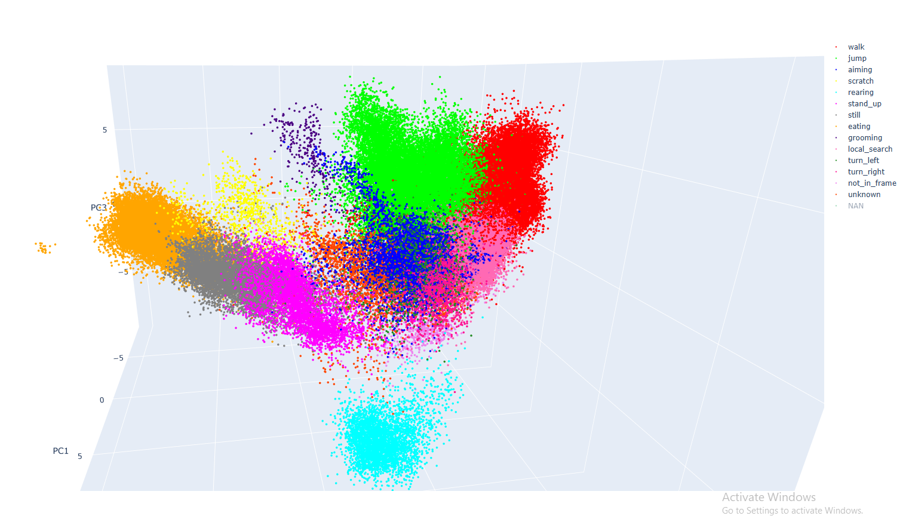

# Rats_Behavior_Classification

This project classifies laboratory rat behaviors from multimodal inputs. It contains the full training pipeline, inference scripts and tools for visualizing latent-space embeddings.

Web Link: [https://jqorange.github.io/Rats_Behavior_Classification/](https://jqorange.github.io/Rats-Behavior-Classification/)



## Model Architecture

Two encoders process IMU and DLC time-series features. Each encoder consists of:

1. **Domain adapter** – session-aware projection mapping raw features to `d_model` dimensions.
2. **Dilated Conv Block** – stacked dilated convolutions (`models/dilated_conv.py`) to capture local patterns.
3. **GRU alignment head** – a small GRU predicting the representation in the other modality.

`EncoderFusion` applies multi-head cross attention to combine the two embeddings, then uses gated residual connections to produce the final sequence representation.

## Training Pipeline

The end-to-end workflow is implemented in `utils/TrainPipline.py`:

1. **Data loading** – `DataLoader` reads IMU/DLC features and labels, aligning sequences.  
2. **Contrastive phase** – `FusionTrainer.train_contrastive_phase` performs semi-supervised contrastive learning to optimize the encoders.  
3. **MLP classification phase** – the encoders are frozen while `MLPClassifier` is trained; DWA weights are evaluated on the test set.  
4. **Cycles** – the two phases form one training cycle, and weights are saved at configured intervals.

Run `train.py` from the project root with the desired arguments. Default values are given in the script and `TrainPipline`.

## Usage

### Environment Setup

Create the environment and install dependencies:

```bash
conda create -n Behavior python=3.10
conda activate Behavior
pip3 install torch torchvision torchaudio --index-url https://download.pytorch.org/whl/cu118
conda install cudatoolkit=11.8
pip install plotly
````

### Training

```bash
python train.py
```

Saved weights will appear under `checkpoints/` as `encoder_x.pkl` and `classifier_x.pkl`.

### Generating Representations

Use `inference.py` to compute latent representations for specified sessions:

```bash
python inference.py --data_path <path_to_dataset> --sessions F3D5_outdoor F3D6_outdoor
```

### Visualization

`plot_embeddings.py` loads the representation files and uses PCA to visualize the class distribution in latent space:

```bash
python plot_embeddings.py --rep_dir representations --sessions F3D5_outdoor
```

## Parameters

* `N_feat_A` / `N_feat_B`: feature dimensions for IMU and DLC inputs.
* `d_model`: hidden dimension for the encoders and cross attention (default 128).
* `nhead`: number of attention heads (default 4).
* `hidden_dim`: size of the MLP classifier's hidden layer.
* `batch_size`: training batch size.
* `contrastive_epochs` / `mlp_epochs`: iterations for each phase of a cycle.
* `n_cycles`: total number of training cycles.
* Additional options such as `temporal_unit`, `smooth_window` and DWA settings can be found in the `FusionTrainer` constructor.

## Data Format

Organize the dataset as follows:

```
IMU/
DLC/
sup_IMU/
sup_DLC/
sup_labels/
```

Files are in `.npy` format. Names follow the pattern `samples_<session>.npy`, `sup_labels_<session>.npy`, etc., and the `session_names` list selects which sessions to use.

## License

This project is licensed under the MIT License. See the [LICENSE](LICENSE) file for details.

---

Further details can be found in the code comments and the scripts' default arguments.
